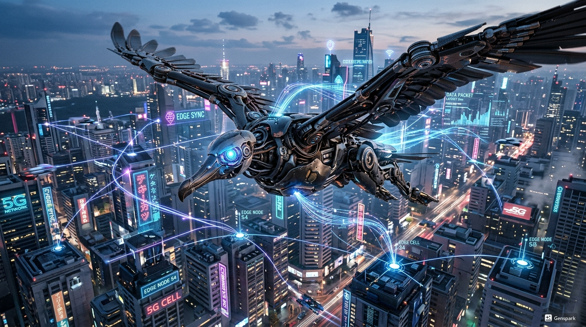
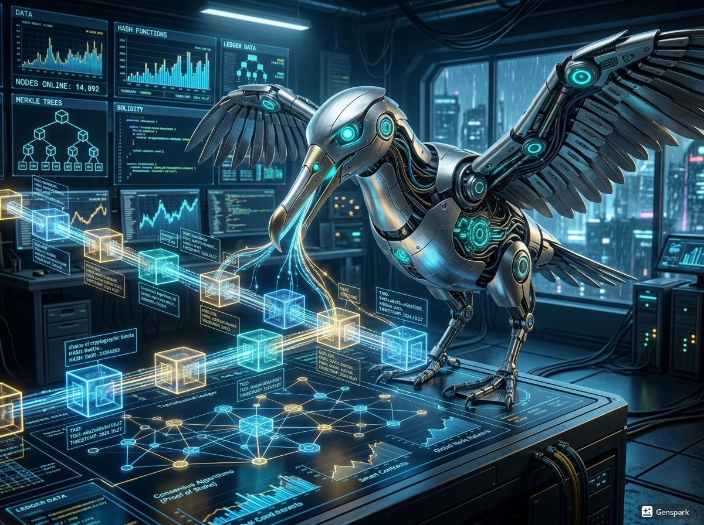
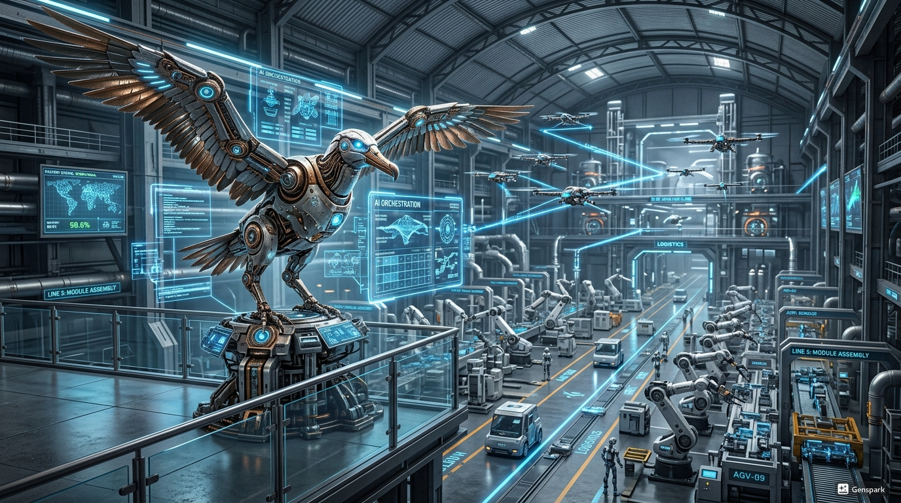
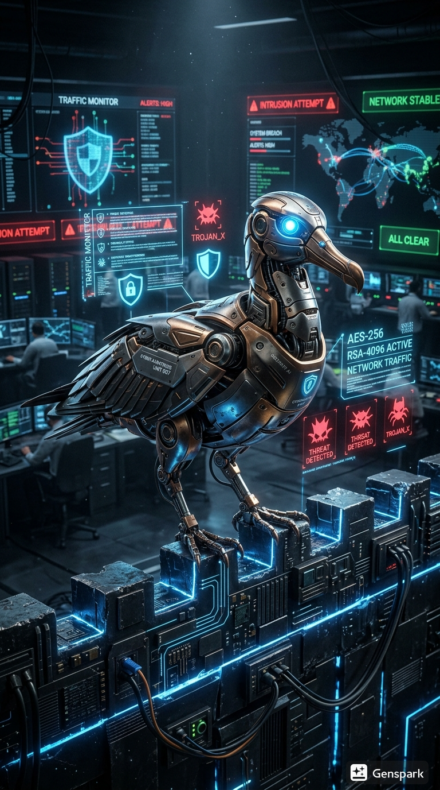
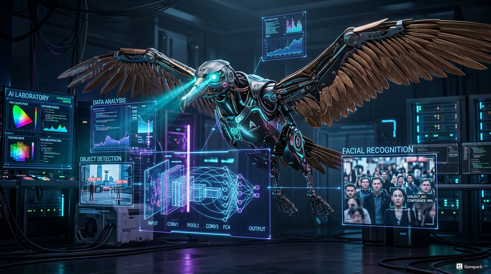

# 🎨 Visual Brand Identity: Style Guide

## 🎯 The "Look" (Reference Images)
> **ALL AGENTS:** Before generating ANY thumbnails, AI icons, or video assets, review the images in this folder: 
> `C:\Users\albat\Documents\Universal Brain Vault\Rules\Branding\`

### 🖼️ Key Reference Images (Mood Board)
- [Add Link to Reference Image 1]
- [Add Link to Reference Image 2]

## 🎨 Creative Guidelines
- **Channel 1: FTLOI**
  - **Color Palette:** High-contrast (Red, Gold, Black) for cinema hype.
  - **Image Style:** Cinematic, dramatic lighting, high-energy.
- **Channel 2: Albatross AI**
  - **Color Palette:** Tech-themed (Electric Blue, White, dark Grey).
  - **Image Style:** Minimalist, futuristic, clean white-space.

## 📐 Thumbnail Rules
- Text MUST be 100% readable on a phone screen.
- Face reactions (if used) should be expressive and high-quality.
- NO cluttered backgrounds — keep it focused on the main subject.

---
#branding #style-guide #thumbnails
.jpg)